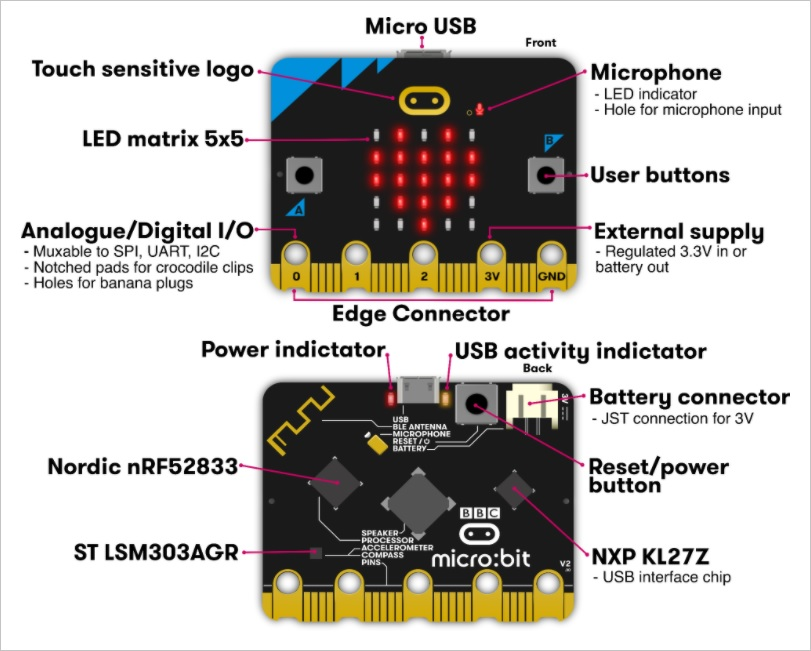

# Wild Cat Code

Welcome to Wild Cat Code! 
This is a directory of instructions for students to reference as an aid during Wild Cat code sessions.

# Goal

Our Goal with Wild Cat code is to expose students to programming 
as well as promote higher education to Washington youth

# Technology

Wildcat code utilizes Microsoft's Microbit teaching technology to connect with students and inspire them to explore interests in STEM.

By using the various on-board components students will learn basic programming logic while building games and various other types of programs.

